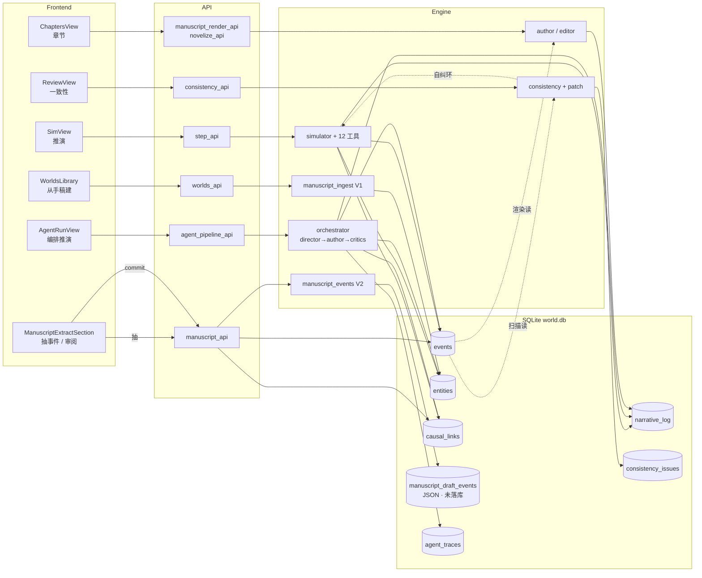

# 千卷阁 · Qianjuange

面向小说创作的世界模拟沙盒。结构化建模实体 / 事件 / 因果 / 时间线 / 分支，AI 工具调用推演 + 改写成章节，也能反向把现有小说原文抽成可继续推演的世界。

[](LICENSE)
[](#安装)
[](#从源码运行)
[](#从源码运行)

> 项目代号 `qianjuange`（千卷阁）。代码内部标识符 / 文件路径用拼音，UI 显示用中文。

---

## 截图

> WIP — 截图待补。看下面的[架构](#架构)和[数据流](#数据流5-条主线)章节先了解项目结构。

---

## 它做什么

千卷阁不是一个对话式 AI 写作助手，而是一个**有持久状态**的小说世界。

- **结构化世界**：实体（角色 / 地点 / 派系）、事件（带时间戳和因果链）、世界设定（lore）、分支时间线，全在 SQLite 里；AI 不"凭空续写"，它读你的世界状态，调工具改世界状态
- **多 Agent 编排**：Director → Author → Critics 流水线（人设审查 + 文风审查自动把关，不通过自动重写）
- **手稿反向构建**：上传现有小说原文，3 级章节检测自动切分；V1 抽骨架（cast / locations / outline），V2 异步抽事件 + 因果链，用户审阅后落库 → 接着推演下去
- **6 种视图**：因果图（cytoscape+dagre）/ 时空带（vis-timeline）/ 阅读视图 / 章节标记 / 仪表盘 / 故事板
- **导出**：Markdown / JSON / DOCX / EPUB
- **AI 配置**：Claude / OpenAI / DeepSeek / Gemini / Grok / 通义 / 智谱 / 月之暗面 / 豆包 / 硅基流动 / OpenRouter / 302.ai / Ollama / LM Studio，14 家全开箱即用
- **API key 加密存储**：本地配置文件不留明文

---

## 安装

### 一键安装包（推荐）

[Releases](https://github.com/PrayLarwence/qianjuange/releases) 下载 `Qianjuange-Setup-x.y.z.exe`，双击下一步。

- 默认装到 `%LOCALAPPDATA%\Programs\Qianjuange`，不需要管理员权限
- 桌面快捷方式可选
- 卸载时弹窗问是否清理 `%APPDATA%\Qianjuange` 下的世界库 / API key
- WebView2 走系统自带（Win10 1809+ / Win11 已内置）

### 系统要求

- Windows 10 17763+ 或 Windows 11
- ~150 MB 磁盘 + ~300 MB 数据目录余量
- 联网（调 LLM 用）

---

## 快速上手

1. 启动后会开一个 webview 窗口（也可以浏览器开 `http://localhost:<动态端口>`，端口写在 `%APPDATA%\Qianjuange\.runtime_port`）
2. 右上角 ⚙ → 选 provider → 填 API key → 测试连接
3. 主页有三步引导：
   - **导入** → 粘小说原文 / 上传 txt → 自动切分章节
   - **抽取** → V1 自动抽骨架；进入世界后再 V2 异步抽事件草稿，审阅后 commit
   - **推演** → SimView 默认走 Director→Author→Critics 流水线，自动写出新章节
4. 左侧栏切换视图：仪表盘 / 推演 / 阅读 / 角色 / 设定库 / 设置 / 审阅 / 图谱 / 时间轴 / 地图 / 故事板

---

## 从源码运行

### 依赖

- Python 3.13
- Node.js 18+
- Windows / 其他 OS（开发模式不限平台，桌面打包目前只做了 Windows）

### 开发模式

```bash
git clone git@github.com:PrayLarwence/qianjuange.git
cd qianjuange

# 后端
python -m venv .venv
.venv/Scripts/activate         # Linux/Mac: source .venv/bin/activate
pip install -r backend/requirements.txt
cd backend && uvicorn app.main:app --reload

# 前端 (另开终端)
cd frontend-next
npm install
npm run dev
```

或 Windows 一键：`run.bat`。

打开 `http://localhost:5173`。

### 运行测试

后端 508 条 pytest（FakeProvider 替身，不打真 LLM 不动 `data/world.db`）：

```bash
run-tests.bat                                       # Windows 一键
cd backend && ../.venv/Scripts/python -m pytest     # 手动
```

前端 27 条 vitest：

```bash
cd frontend-next
npm test                # vitest watch
npm run build           # vue-tsc + vite build
```

### 打 Windows 安装包

```bash
build/build-installer.bat
```

依次：构建前端 → PyInstaller 打 onedir → Inno Setup 编安装包。产物在 `build/installer/`。

需要预装：
- [PyInstaller](https://pyinstaller.org/) 进 `.venv-build`（独立打包用 venv，避免污染开发 venv）
- [Inno Setup 6](https://jrsoftware.org/isdl.php) + 简体中文语言文件 `ChineseSimplified.isl` 放进 `Languages/`

---

## 架构

```
backend/app/
  models/      SQLAlchemy + SQLite (world.db)
  providers/   14 家 LLM provider, 走 Provider 基类 + registry
  engine/      按域归 8 子目录
               agents/      orchestrator / agent_pipeline / author / editor / multi_agent
               manuscript/  manuscript_ingest (V1) / manuscript_events (V2) / scene_continuity
               consistency/ consistency / patch
               core/        simulator / executor / tools / state / snapshots / jobs / metrics
               narrative/   novelize / pov / recap / persona_extract / thread_aging / transitions
               worldgen/    worldgen / blueprint / lore_gaps / style_seeds
               embedding/   local_bge / siliconflow / zhipu
               map/         map_sim
  api/         FastAPI 路由, routes.py 46 行只做 router 聚合
               业务端点拆在 19 个 *_api.py 子模块
  paths.py     XDG 化数据目录解析 (开发: ./data, 打包: %APPDATA%\Qianjuange)

frontend-next/  Vue 3 + Vite + TS (主前端)
  views/world/  各视图
  components/world-settings/  WorldSettingsView 8 个子 section

frontend/       Alpine.js 老前端 (已冻结)
build/          PyInstaller spec + Inno Setup .iss + 一键 .bat
data/           开发模式数据目录 (world.db / llm_config.json / maps / jobs)
```

### 后端 API 子路由

| 文件 | 内容 |
| --- | --- |
| `worlds_api.py` | 世界 CRUD |
| `world_settings_api.py` | PATCH /worlds/{id}（style_profile + WorldLore） |
| `branches_api.py` | 分支切换 / 重命名 / 删除 |
| `entities_api.py` | 角色 / 地点 / 派系 |
| `events_api.py` | 事件 CRUD |
| `step_api.py` | 推演 step / auto / reconcile job |
| `history_api.py` | 快照 / 时间轴回滚 |
| `timeline_api.py` | 时间轴查询 |
| `chapters_api.py` | 章节标记 |
| `manuscript_api.py` | 手稿导入、事件草稿抽取 (V2) |
| `manuscript_render_api.py` | 章节预览 / 渲染 |
| `novelize_api.py` | 单章成稿 |
| `export_novel_api.py` | 整本导出 |
| `consistency_api.py` | 一致性扫描 / issue / patch |
| `agent_pipeline_api.py` | 流水线配置 + 编排推演 + trace |
| `templates_api.py` | 世界模板 |
| `explore_api.py` | 探索建议 |
| `llm_api.py` | LLM 配置 |

---

## 数据流（5 条主线）

5 条流程**共享同一张 Event 表 + Entity 表**——记住这点，新人才能判断"我改这块会影响谁"。



**关键观察**：
- V2 抽出的事件落库后跟推演 step 写的 Event 在同一张表，commit 后能无缝继续推演
- 一致性扫描结果反向喂推演（top-5 open issue 进 director system prompt）
- 章节渲染只读不写 events，但写 NarrativeLog + ChapterMarker
- Orchestrator 和 Simulator 两条路径并存，各自写 Event，AgentRunView 实时看 trace

---

## 手稿 V1 vs V2

最容易踩混的地方。两条都是"用 LLM 处理用户上传的小说"，但触发点 / 写入位置 / 落库时机完全不同。

```mermaid
flowchart TB
    Input[用户上传小说原文]

    subgraph V1[V1 · 建世界时一次性]
        direction TB
        V1A[POST /worlds/from_manuscript<br/>同步]
        V1B[manuscript_ingest.py<br/>30 章/批 或 60k 字/批<br/>抽 cast/locations/factions/outline]
        V1C[直接写库:<br/>World + Branch + Entity]
        V1A --> V1B --> V1C
    end

    subgraph V2[V2 · 建世界后逐章抽]
        direction TB
        V2A[POST /manuscript/extract_events_async<br/>异步 job]
        V2B[manuscript_events.py<br/>10 章/批抽事件<br/>60 事件/批抽因果链<br/>支持 chapter_indices 增量]
        V2C[写到 manuscript_draft_events<br/>JSON · 未落库]
        V2D[ManuscriptExtractSection<br/>审阅 / 改 participants / 改地点]
        V2E[POST /manuscript/commit_events<br/>真写入 events + causal_links]
        V2A --> V2B --> V2C --> V2D --> V2E
    end

    Input --> V1
    V1 -.-> V2A
    Input -. 已有世界后<br/>再粘原文 .-> V2A

    style V1C fill:#1a3a1a,stroke:#4a8a4a
    style V2C fill:#3a3a1a,stroke:#8a8a4a
    style V2E fill:#1a3a1a,stroke:#4a8a4a
```



| 维度 | V1 | V2 |
| --- | --- | --- |
| 文件 | `engine/manuscript/manuscript_ingest.py` | `engine/manuscript/manuscript_events.py` |
| 触发 | 建世界时（必经） | 建世界后（可选） |
| 同步性 | 同步 endpoint | 异步 job runner |
| 长篇风险 | >180k 字可能超时 | 无（job 模式） |
| 写库时机 | 立即 | 用户审阅后手动 commit |
| 写到哪 | World / Branch / Entity 表 | `world.manuscript_draft_events` JSON → commit 后写 events / causal_links |
| 抽什么 | cast / locations / factions / outline / setting | 事件列表 + 因果链 |
| 增量支持 | 否 | 是（`chapter_indices` 范围） |
| 因果链 | 不抽 | 抽（事件 pass 之后再跑因果 pass） |

---

## AI 工具集

`create_entity` · `update_entity` · `add_event` · `update_event` · `delete_event` · `link_causality` · `advance_time` · `branch_world` · `narrate` · `set_position` · `move_entity` · `end_turn`

---

## 路线图

- [ ] 视图层端到端测试（Playwright / Cypress）
- [ ] 阅读模式：连续滚动 + 暗色主题
- [ ] Best-of-K Author（K 个候选 critic 投票挑最高分）
- [ ] Arc Critic（跨 tick 主线 / 设定一致性专管）
- [ ] 多 Author 分工（dialogue / description / action 各一个，stitcher 拼）
- [ ] i18n 多语言

---

## 注意事项

- **`frontend/` 已冻结**（2026-01）。新功能只进 `frontend-next/`。详见 `frontend/FROZEN.md`
- 添加新后端端点：在 `app/api/` 下找最贴近的 `*_api.py` 加进去，或新建 `xxx_api.py` 后在 `routes.py` 加两行 `import` + `include_router`
- 添加新世界设置 section：在 `frontend-next/src/components/world-settings/` 新建 `XxxSection.vue`，在 `WorldSettingsView.vue` 编排即可
- DeepSeek 走 OpenAI 兼容协议，原生 tool calling
- Ollama / LM Studio 用 prompt 模拟工具调用，不如原生稳定
- AI 调用消耗 Token；state 自动截断到最近 30 事件 + 80 实体
- 数据目录在打包模式下走 `%APPDATA%\Qianjuange`，开发模式走 `./data`，可用 `NARRATIVE_SANDBOX_DATA_DIR` 环境变量覆盖

---

## 文档

- [`CLAUDE.md`](./CLAUDE.md) — 给 AI agent 自动加载的开发约定
- [`docs/GLOSSARY.md`](./docs/GLOSSARY.md) — 项目里那些字面意思和实际语义对不齐的词（World / Branch / tick / V1 vs V2…）
- [`docs/design_review.md`](./docs/design_review.md) · [`project_review.md`](./docs/project_review.md) · [`requirements_review.md`](./docs/requirements_review.md)

---

## License

[Apache License 2.0](LICENSE) · Copyright 2026 Larwance
