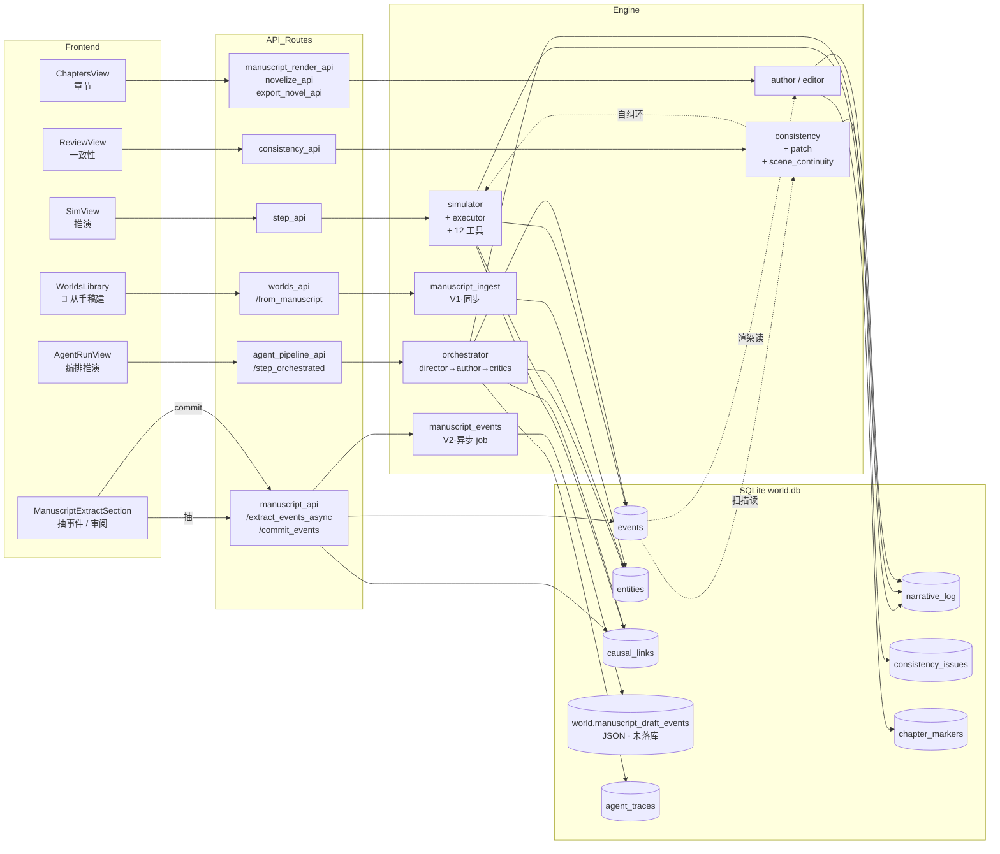

# Narrative Sandbox

面向小说创作的世界模拟沙盒。结构化建模实体 / 事件 / 因果 / 时间线 / 分支，AI 工具调用推演 + 改写成章节。

> **新 agent 进项目先读**：
> - [`CLAUDE.md`](./CLAUDE.md) — 给 agent 自动加载的开发约定 + 当前重构状态
> - [`docs/GLOSSARY.md`](./docs/GLOSSARY.md) — 项目里那些字面意思和实际语义对不齐的词（World / Branch / tick / V1 vs V2 …）
> - 本文件下半部分的 Mermaid 数据流图

---

# 当前会话状态（给下一位 agent / 给中断后的自己）

## 已完成 — 大型结构重构（R 系列）
代码 build 通过，397 后端测试全过，27 前端测试全过，vue-tsc 0 错，vite build 干净。**没跑端到端真实小说回归**，只验证类型/编译/单测。

### 工程债清理（2026-05）
- engine 31 文件归入 8 子目录（agents/manuscript/consistency/worldgen/core/narrative/embedding/map），旧位置 stub 兼容
- manuscript_chunks 独立表（JSON 列迁出为 ManuscriptChunk 表，自动迁移旧数据）
- Entity.aliases 独立列（从 attributes JSON 拆出）
- metrics 可观测性：LlmCallMetric 表 + MetricsProvider 包装器 + `GET /metrics` 聚合查询
- 前端测试：vitest + @vue/test-utils，27 条覆盖 stores + ConfirmDialog + Markdown
- 导出 docx + epub：`POST /worlds/{id}/export` 新增 mode=docx|epub

### 功能深化
- V1 转异步 job：`POST /worlds/from_manuscript_async`，>10 万字自动走后台
- 智能文本分割：3 级章节检测 + 字数回退分割（5000 字/段）
- 编排流水线推至前台：SimView 默认 Director→Author→Critics 模式，预置人设+文风 2 个 critic
- V2 审阅增强：每个草稿事件可展开原文 200 字对照
- 推演后自动一致性检查，SimView 顶栏显示待处理问题数
- SettingsDrawer：LLM 配置面板（provider/model/key/测试连接）+ 24h metrics 统计

### Pipeline 深化（首批，2026-05）
- **Critic 跨轮记忆**：第 N 轮 critic 收到自己上轮的 verdict / reason / suggestions，prompt 里指示"只评估改后是否解决，不要复读已修问题"。trace `extra.prev_round_used` 标记是否吃了上轮记忆
- **forced_accept 浮出水面**：`run_orchestrated_step` 返回 `unresolved_critics` 数组；SimView 在 forced_accept / budget_exhausted 时显示警示带，列出每个未解决 critic 的 reason + suggestions
- **Pipeline 指标进 Dashboard**：新端点 `GET /worlds/{id}/pipeline_metrics?hours=168`，聚合 AgentTrace 给出 first_pass_rate / forced_accept_rate / avg_critic_rounds + 每个 critic 的 runs/pass/fail/fail_rate/avg_score。DashboardView 加 Pipeline 卡片
- 测试：`test_critic_prev_round_threaded_into_prompt` + `test_forced_accept_returns_unresolved_critics` + `test_query_pipeline_metrics_aggregates`

### 体验优化
- **仪表盘**（DashboardView）：世界统计 + LLM metrics + 实体分布 + 最近事件 + LLM 调用日志
- **三步引导**：导入→抽取→推演，当前步高亮
- **大文件导入**：>512KB 不塞 textarea，>10 万字自动走异步 job，顶部 spinner 实时进度
- 侧边栏分组：创作（仪表盘/推演/阅读）· 世界（角色/设定库/设置）· 分析（审阅/图谱/时间轴/地图/故事板）
- 手稿横幅直接跳转抽取区
- 文件选择器无格式限制
- 风格绑定提醒

### R-A：冻结老 frontend/
`frontend/` 目录加 `FROZEN.md`。新功能只进 `frontend-next/`。

### R-B / R-D：拆分 routes.py
原 `backend/app/api/routes.py` ~2680 行 / 68 端点的巨型文件，按业务域拆成 19 个子路由文件，主文件压成 **46 行**的 router 聚合点。新增子模块：
```
manuscript_api / consistency_api / entities_api / llm_api / templates_api
chapters_api / events_api / manuscript_render_api / novelize_api
export_novel_api / explore_api / history_api / step_api / branches_api
timeline_api / worlds_api / world_settings_api / agent_pipeline_api
```
共享 helper 抽到 `_common.py`（`_new_id` / `_id_prefix_for`）。前端调用路径完全保留，无需改动。

### R-C：拆分 WorldSettingsView
原 `frontend-next/src/views/world/WorldSettingsView.vue` 927 行单文件视图，按功能区拆为 8 个独立子组件，父视图压到 **77 行**纯协调。子组件落在 `src/components/world-settings/`：
```
BasicInfoSection (85)        MaxTickSection (54)
StyleProfileSection (154)    AgentPipelineSection (247)
BranchesSection (117)        SnapshotsSection (72)
ManuscriptExtractSection (417) DangerZoneSection (48)
```
顺手修了 4 个 baseline TS 错（`_expand` 类型）和 1 个 dead branch（`'failed'` 不在 status union 里）。

---

## 之前完成 — 待真实小说测试
**T3 全部 + T2 全部 + T1 全部**，build 通过，没跑端到端真实小说验证。

### T1：一致性扫描全链路（已落地）
- `engine/consistency/consistency.py`（300 行）：五类扫描（性格/能力/规则/时间线/关系）+ `engine/manuscript/scene_continuity.py`（229 行）：场景连续性专用扫描
- `engine/consistency/patch.py`（326 行）：editor 输出可 apply/reject/undo 的文字 patch，`consistency_api.py` 12 个端点完整覆盖
- `ReviewView.vue`（416 行）：status/severity 过滤、展开详情、patch 管理、entity 关联
- 自纠环：`engine/core/simulator.py` 的 `_build_self_correction_block()` 取 top-5 open issue 喂 director
- 测试：`test_consistency.py` + `test_issue_patch.py` + `test_scene_continuity.py`

### Agent Pipeline 编排流水线（全新）
- `engine/agents/agent_pipeline.py`（150 行）：PipelineConfig schema + 全局 default 持久化（`data/agent_pipeline_default.json`）
- `engine/agents/orchestrator.py`（629 行）：director→author→critics 编排，支持 parallel/serial critic 模式、重试循环、预算控制（max_llm_calls + max_wall_seconds）
- `agent_pipeline_api.py`：配置 CRUD + `/step_orchestrated` 异步 job + trace 增量拉取
- `SimView` 集成（commit 8e6e695 推至前台）：默认走编排，切换器可回退单 agent；旧 `AgentRunView.vue` 仍保留路由 `/agent-run` 作直链调试用，侧边栏入口已移除
- `AgentPipelineSection.vue`（247 行）：WorldSettingsView 第 8 个 section，支持"保存到本世界 / 设为全局默认 / 重置为继承全局"
- `AgentTrace` 表：每次 LLM 调用写一条，含 full_prompt/full_response
- 测试：`test_orchestrator.py`

### T3-A：Overview manuscript banner
`frontend-next/src/views/world/OverviewView.vue`。世界主页加横幅：有待审草稿 → 强调色「N 个事件草稿待审阅」；有手稿但 current_tick=0 → 灰色「N 章已切分」+「抽取事件」；点 banner 跳 settings。

### T3-B：按章节范围抽取
- 后端 `manuscript_api.py` `/manuscript/extract_events_async` 接收可选 `chapter_indices`
- `backend/app/engine/manuscript/manuscript_events.py` `extract_events()` 加 `chapter_indices` + `on_batch_complete` 回调
- 合并语义：抽全部 → 替换整张 draft；抽指定范围 → 仅替换那几章，其它章节既有 draft 保留
- 前端 `ManuscriptExtractSection` 加范围输入 `5-7,10` 解析

### T3-C：Job 中途持久化
runner 维护 `accumulated` 列表，每批 LLM 完 → 立刻 `manuscript_draft_events = accumulated; commit()`。崩溃后再次抽取只重跑剩余章节（配合 T3-B 范围筛选）。

### T2-A：V1 长小说分批抽骨架
`backend/app/engine/manuscript/manuscript_ingest.py` 由单次 LLM 改成滑动批次（`PER_BATCH_CHARS=60_000` / `CHAPTERS_PER_BATCH=30` 双约束）。多批合并 cast / locations / factions / outline。`MAX_OUTLINE` 80 → 200。

**风险**：V1 仍同步 endpoint。> 3 批（>180k 字）可能踩超时。下一步若需要要改成 job 异步（参考 V2 `extract_events_async` runner 写法）。

### T2-B：角色别名归一
- `engine/manuscript/manuscript_ingest.py` SYSTEM_PROMPT 加 `aliases:[]`，`_normalize_cast` 收 aliases，多批合并按 `cast_alias_owner` 归并
- `worlds_api.py` `create_world_from_manuscript` 写 `Entity.attributes['aliases']`
- `manuscript_api.py` V2 `extract_manuscript_events_async` 构 lookup 时把 aliases 一并加入

**风险**：识别率取决于模型。如果 LLM 不肯吐 aliases，需要更激进 prompt。

### T2-C：因果链抽取
- `engine/manuscript/manuscript_events.py` 新增 `extract_causal_links()`：滑动窗口（60 事件 / 重叠一半 / `CAUSAL_LOOKBACK_TICKS=80`）
- `DraftEvent.causes: list[int]`（上游 tick 列表）
- V2 runner：抽完事件再跑因果 pass，写回每个 event 的 `causes`
- `commit_events` 接收 `causes`，按 draft_tick→event_id 映射写 `CausalLink` 行
- 返回值多 `causal_links_written`

**风险**：长小说总耗时翻倍；> 80 tick 跨度的因果会漏。

### T2-D：审阅 UI 可改 participants / location
`ManuscriptExtractSection.vue`：审阅 modal 每个事件加角色 chip 行（点击移除）+「+ 添加 / 修改」chip 选择器 + 地点 `<select>`。`toggleParticipant` / `setEventLocation` 直接改 reactive draft，commit 正常带 `participant_ids` / `location_id`。

---

## 测试路径（建议）
找一本 100k+ 字、人物有别称、因果清晰的中文小说（金庸短篇 / 网文前 50 章）：

1. 新建世界（V1 ingest）→ 看 `Entity.attributes.aliases` 字段
2. Overview 应有 banner → 点跳 settings
3. 抽全部章节 → 看 `causal_link_count > 0` 和 `draft_event_count` 接近章节 × 2-3
4. 故意分两次抽：先抽 1-10，再抽 11-20，验证 1-10 的 draft 没被冲掉
5. 打开审阅 → 故意改几个 participants / location → 落库
6. 进 GraphView → 看因果连边
7. 进 Cast → 看 aliases

## 数据库
**无 schema 变更**。aliases 进 `Entity.attributes` JSON、causes 进 `manuscript_draft_events` JSON、`CausalLink` 表已存在。不需要迁移。

## 启动
```bash
cd backend && uvicorn app.main:app --reload         # 后端
cd frontend-next && npm run dev                     # 前端
```
或 Windows 一键：`run.bat`

## Pipeline 深化路线（剩余）

按"中→高成本 / 影响"排，按需推进：

### 4. Best-of-K 在 Author 阶段（中成本，质感跃升）
当前 1 个 author 跑出来不行就重写。改成"K 个版本并行（不同 temperature / system prompt 微调），critics 给每个打分，取最高，仍 fail 触发重写"。
- 实现要点：`_author_phase` 改成 K 路 `asyncio.gather`；critic 一次性看 K 个候选给出 ranked verdict；K=1 时退化为现状
- 代价：LLM 调用 ×K。建议做成 toggle，只对"重要 tick"开（用户标星 / 大事件）
- 风险：K 个候选高度同质 → 浪费预算。需要 prompt 里强制差异化（"version A 偏对话，version B 偏内心"）

### 5. Recap / Arc 喂 Critic（中成本，跨 tick 一致性）
Director 已用 chapter recap（`engine/narrative/recap.py`）和 issue 自纠环。Critic 看不到这些。加一个 "Arc Critic" 专管：本 tick 是否推进主线、是否和 N tick 前的设定冲突。
- 实现要点：`_build_critic_user_prompt` 加可选 `arc_context` 段；新建 `CriticAgent.kind: 'arc'` 类型，从 `engine/narrative/recap.build_recap_block()` 取上下文塞进去
- 代价：长 prompt → 慢 + 贵；和现有"人设 / 文风"critic 部分关切重叠
- 配合：`AgentPipelineSection` 加"Arc critic"快捷模板按钮

### 6. 多 Author 分工（结构性，工作室模式）
dialogue / description / action 三个 author 各擅长一段，stitcher agent 拼起来。或两 author 走不同 style，critics 投票挑。
- 实现要点：`PipelineConfig.authors` 列表语义从"主备"改成"分段"，加 `AuthorAgent.role: 'dialogue' | 'description' | 'action' | 'stitcher'`；author phase 重写为分段→并行→拼接
- 风险：风格断层。stitcher 必须能感知整段语气是否一致
- 前置：style profile 系统需要扩成"按段落类型映射"，否则三个 author 拿同一份 style 没意义

### 7. V2 抽取也接 Critic（中成本，准确率提升）
现在 manuscript 抽事件 → 直接 commit，没有审稿。LLM 抽错了用户得肉眼审。加 "fact-check critic" 对比原文 source_context 验证 event，对不上退回重抽。
- 实现要点：`engine/manuscript/manuscript_events.py` 的 `extract_events()` 加可选 `fact_check_pass`；用 `event.source_context`（已存）做 grounding 验证；不通过的事件标 `needs_review`
- 配合：审阅 UI 加"fact-check 失败"过滤器
- 代价：抽取耗时翻倍；但能省掉用户审阅时间，净收益

### 8. 用户反馈闭环（结构性，在线学习）
读完一章打个分（差/普通/好），低分 tick 的 critic chain 进负例库，下次同类场景的 critic prompt 附"以下是过去类似情境的失败案例"。
- 实现要点：新建 `chapter_feedback` 表（chapter_id + score + comment）；critic prompt 拼接时检索同 world / 同 critic 的历史负例（top-3 by recency）
- 风险：prompt 失控膨胀；负例库可能过拟合早期评分
- 前置：先把 ChaptersView 加打分按钮，跑几周收集数据再启用闭环

---

## 下一批待办
1. **端到端真实小说测试**（最大空缺）：找一本 100k+ 字中文小说，跑完整 V1→V2→审阅→续写→导出，记录阻断性 bug
2. **前端测试扩展**：当前 27 条覆盖 stores + 2 组件，View 层仍无测试
3. **阅读模式增强**：连续滚动不分页、暗色阅读主题
4. **多语言 i18n**：当前只有中文

---

# 项目快速参考

## 它做什么
- **推演**：实体 / 事件 / 因果 / 多分支 / AI 工具调用
- **视图**：因果图（cytoscape+dagre）/ 时空带（vis-timeline）/ 阅读视图 / 章节标记
- **AI**：角色 sub-agent + 导演、persona 萃取、一致性扫描 + editor patch、角色弧光、关系图谱、POV 改写
- **多 Agent 编排**：Director→Author→Critics 流水线（SimView 默认模式），人设审查+文风审查自动把关，不通过自动重写
- **仪表盘**：世界统计 + LLM token/延迟/错误 metrics + 实体分布 + 事件时间线 + 调用日志
- **智能导入**：3 级章节检测 + 字数回退分割；>10 万字异步后台；大文件不卡死
- **导出**：Markdown / JSON / DOCX / EPUB
- **世界生成**：模板系统、Voronoi 程序化地图
- **手稿反向构建（V1+V2）**：上传现有小说 → 抽骨架 → 抽事件草稿 → 审阅落库 → 继续推演

## 架构
```
backend/app/
  models/      SQLAlchemy + SQLite（world.db）
  providers/   Claude / OpenAI / DeepSeek / Ollama
  engine/      已按域归入 8 子目录（旧扁平路径保留为 stub 转发，不会断 import）
               agents/      orchestrator / agent_pipeline / author / editor / multi_agent / character_view / dialogue_rehearsal
               manuscript/  manuscript_ingest（V1）/ manuscript_events（V2）/ scene_continuity
               consistency/ consistency / patch
               core/        simulator / executor / tools / state / snapshots / jobs / metrics
               narrative/   novelize / pov / recap / persona_extract / draft_cleanup / thread_aging / transitions
               worldgen/    worldgen / blueprint / blueprint_render / lore_gaps / style_seeds
               embedding/   base / local_bge / siliconflow / zhipu
               map/         map_sim
  api/         FastAPI 路由 — routes.py 仅 46 行 router 聚合
               业务端点拆在 *_api.py 子模块（见下）
frontend-next/  Vue 3 + Vite + TS（新前端，主用）
  src/views/world/        各视图，最大 ChaptersView / GraphView
  src/components/         全局共享（Dialog / ConfirmDialog / Toast 等）
  src/components/world-settings/   WorldSettingsView 8 个 section 子组件
frontend/       Alpine.js 老前端（已冻结，见 frontend/FROZEN.md）
data/
  world.db
  llm_config.json
```

### backend/app/api/ 端点拆分（共 19 个子路由）
| 文件 | 内容 |
| --- | --- |
| `worlds_api.py` | 世界 CRUD（POST/GET/DELETE /worlds） |
| `world_settings_api.py` | PATCH /worlds/{id}（含 style_profile / WorldLore 联动） |
| `branches_api.py` | 分支切换 / 重命名 / 删除 |
| `entities_api.py` | 角色 / 地点 / 派系等实体 |
| `events_api.py` | 事件 CRUD |
| `step_api.py` | 推演 step / auto / reconcile job |
| `history_api.py` | 快照 / 时间轴回滚 |
| `timeline_api.py` | 时间轴查询 |
| `chapters_api.py` | 章节标记 |
| `manuscript_api.py` | 手稿导入、事件草稿抽取（V2） |
| `manuscript_render_api.py` | 章节预览 / 渲染 |
| `novelize_api.py` | 单章成稿 |
| `export_novel_api.py` | 整本导出 markdown |
| `consistency_api.py` | 一致性扫描 / issue / patch / scene_continuity |
| `agent_pipeline_api.py` | Agent 流水线配置 + 编排推演 + trace 拉取 |
| `templates_api.py` | 世界模板 |
| `explore_api.py` | 探索建议 |
| `llm_api.py` | LLM 配置 |
| `_common.py` | 共享 helper（`_new_id` / `_id_prefix_for`） |

另有几个旧命名的独立路由：`map_routes.py` / `dialogue_routes.py` / `lore_routes.py` / `stats_routes.py` / `storyboard_aux_routes.py`，未参与本轮重构。

## 数据流（5 条主线）

5 条流程**共享同一张 Event 表 + Entity 表**。这是项目的核心心智模型——记住这点，新 agent 才能判断"我改这块会影响谁"。



**关键观察**：
- V2 抽出的事件落库后，跟推演 step 写出的 Event 在同一张表，所以用户能在 V2 commit 之后无缝继续推演
- 一致性扫描的结果会反向喂给推演（"自纠环"，top-5 open issue 进 director system prompt）
- 章节渲染只读，不写 events；但写 NarrativeLog（`role=author_final`）和 ChapterMarker
- Agent 编排流水线（orchestrator）和传统推演（simulator）两条路径并存，各自写 Event 表，AgentRunView 实时查看 trace

## 手稿 V1 vs V2

最容易踩混的地方，单独画一张。两条都是"用 LLM 处理用户上传的小说"，但触发点、写入位置、落库时机完全不同。

```mermaid
flowchart TB
    Input[用户上传小说原文]

    subgraph V1[V1 · 建世界时一次性]
        direction TB
        V1A[POST /worlds/from_manuscript<br/>同步 endpoint]
        V1B[manuscript_ingest.py<br/>· 章节切分<br/>· 30 章/批 或 60k 字/批<br/>· LLM 抽 cast/locations/factions/outline]
        V1C[直接写库:<br/>World + Branch + Entity]
        V1A --> V1B --> V1C
    end

    subgraph V2[V2 · 建世界后逐章抽]
        direction TB
        V2A[POST /manuscript/extract_events_async<br/>异步 job · 1.5s 轮询]
        V2B[manuscript_events.py<br/>· 10 章/批抽事件<br/>· 60 事件/批抽因果链<br/>· 支持 chapter_indices 增量<br/>· 每批完立刻 persist 防丢]
        V2C[写到 world.manuscript_draft_events<br/>JSON · 未落库]
        V2D[用户在 ManuscriptExtractSection<br/>审阅 / 改 participants / 改地点]
        V2E[POST /manuscript/commit_events<br/>真写入 events + causal_links]
        V2A --> V2B --> V2C --> V2D --> V2E
    end

    Input --> V1
    V1 -.-> V2A
    Input -. 也可以已有世界后<br/>再粘原文 .-> V2A

    style V1C fill:#1a3a1a,stroke:#4a8a4a
    style V2C fill:#3a3a1a,stroke:#8a8a4a
    style V2E fill:#1a3a1a,stroke:#4a8a4a
```



**对比表**：

| 维度 | V1 | V2 |
| --- | --- | --- |
| 文件 | `engine/manuscript/manuscript_ingest.py` | `engine/manuscript/manuscript_events.py` |
| 触发 | 建世界时（必经） | 建世界后（可选） |
| 同步性 | 同步 endpoint | 异步 job runner |
| 长篇风险 | >180k 字可能超时 | 无（job 模式） |
| 写库时机 | 立即 | 用户审阅后手动 commit |
| 写到哪 | World / Branch / Entity 表 | `world.manuscript_draft_events` JSON → commit 后写 events / causal_links |
| 抽什么 | cast / locations / factions / outline / setting | 事件列表 + 因果链 |
| 增量支持 | 否 | 是（`chapter_indices` 范围） |
| 因果链 | 不抽 | 抽（事件 pass 之后再跑因果 pass） |

## AI 工具集
`create_entity` / `update_entity` / `add_event` / `update_event` / `delete_event` / `link_causality` / `advance_time` / `branch_world` / `narrate` / `set_position` / `move_entity` / `end_turn`

## LLM 配置
启动后打开 http://localhost:8000，⚙ 图标，填 Key、选模型、测试连接。存于 `data/llm_config.json`，覆盖 `.env`。

## 测试
397 pytest（FakeProvider 替身，不打真 LLM 不动 `data/world.db`）。
```bash
run-tests.bat                                       # Windows 一键
cd backend && ../.venv/Scripts/python -m pytest     # 手动
```

前端：
```bash
cd frontend-next && npm run build   # vue-tsc + vite build
```

## 注意事项
- **`frontend/` 已冻结**（2026-01）。新功能只进 `frontend-next/`。详见 `frontend/FROZEN.md`
- 添加新后端端点：在 `app/api/` 下找最贴近的 `*_api.py` 加进去，或新建 `xxx_api.py` 后在 `routes.py` 加两行 `import` + `include_router`
- 添加新世界设置 section：在 `frontend-next/src/components/world-settings/` 新建 `XxxSection.vue`，在 `WorldSettingsView.vue` 编排即可
- DeepSeek 走 OpenAI 兼容协议，原生 tool calling
- Ollama 用 prompt 模拟工具调用，不如原生稳定
- AI 调用消耗 Token；state 自动截断到最近 30 事件 + 80 实体

